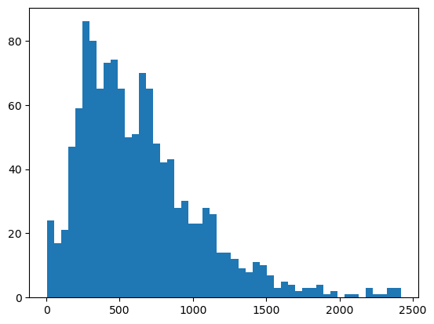

---
title: BERT and RNN models
layout: default
filename: bert_and_rnn
--- 

## Steps to Take for this Section
First go to the Environment directory and perform `conda env create -f general_env.yml` and `activate general_env` to create the environment needed for this section of the project. Then proceed to the Cleaning directory and run the specialty_data_preprocessing.ipynb notebook in its entirety to populate the Data directory with all of the data required. Then proceed to the Specialty-Models directory. First focus on the bert.ipynb, file to create the BERT models of your choosing, you can quickly change MODEL to the other BERT models I trained in my documentation if you are interested in seeing the varying results for yourself. The bert_metrics.ipynb notebook will show the confusion matrix for the model of your choosing, currently it is my absolute path, but change it to your absolute path to where ever the final_model directory is located in your saved model. Then in test-bert.ipynb, you can change the absolute path to the same final_model again and then test the model with any transcript of your choosing in the bottom cell. This concludes everything required to work with the BERT models, and now I will dive into how to create the RNN models.

Go to the Environment directory and perform `conda env create -f rnn_env.yml` and `activate rnn_env` to create the environment needed for the rnn models. If you had not done this already, proceed to the Cleaning directory and run the specialty_data_preprocessing.ipynb notebook in its entirety to populate the Data directory with all of the data required. Then proceed to the Specialty-Models directory. Use the rnn.ipynb notebook to create two distince RNN models that you can test and interact with. Then in test-rnn.ipynb, you can change the relative path to the RNN of your choosing and then test the model with any transcript of interest in the bottom cell. This concludes everything required to work with the RNN models.

## Writeup

For this dataset, it began with me inspecting, encoding, and feature engineering the data to be best interpreted by the models I planned to create within the specialty_data_preprocessing.ipynb notebooks.

<ins> Data Preprocessing Results </ins>

Within the dataset, I found some nulls which led to me dropping those entries. I then cleaned a redundant column in the dataset and inspected the dataset. It was imbalanced where the most common column dwarfed every other category, I decided to remove the category from contention and considered the columns after. I then had to decide how many categories to classify, there were 40 categories in total, I decided to see how models would perform with 10, 5, and 3 categories. By the end of my development, the 10 categories reached 60% accuracy, the 5 and 3 categories reached 80% accuracy. I believe they reached these results due to a lack of overall data, but i wanted to see where I could take the challenge despite only have approximately 1,000 text entries. I then encoded each category to labels for the model to determine what category a transcript belongs in.

Then in Figure 1, I realized that the majority of the transcripts were over 512 tokens outside of the bounds of traditional BERT models so I created a new transcript_summarized entry where I truncate the transcript from the start to the end to potentially improve accuracy in the future. I also calculated the weights of each category since there was a small imbalance and I thought that could help improve my models as well. I then stored all the data in the Data directory.

<figure style="text-align: center;">
  
  <figcaption>Figure 1: Tokens per Transcripts</figcaption>
</figure>

<ins> BERT Models </ins>
I tried many different BERT models which can be observed in MODELs and defaulted to Microsoft's as the highest performing. Overall, I could squeeze out performance to 80%.
<ins> RNNs </ins>
I tried 3 different RNNs, a simple RNN, a more advanced RNN, and a RNN with a pretraineed embedding layer. I could only peak out to 60%.

There is some interesting conversations to be had about the difference and results of these models, but time constraints prevent me from diving deeper in this writup.

These models can be recreated and tested with the above instructions, but overall I am happy with the results that I could achieve on such a challenging dataset.