---
title: Traditional Machine Learning Models
layout: default
filename: classification_and_regression
--- 

## Steps to Take for this Section
First go to the Environment directory and perform `conda env create -f general_env.yml` and `activate general_env` to create the environment needed for this section of the project. Then proceed to the Cleaning directory and run the medical_cost_data_preprocessing.ipynb notebook in its entirety to populate the Data directory with all of the data required. Then proceed to the Medical-Cost-Models directory. Feel free to go in any order for the Classification, Regression, Data-Visualization, and Unsupervised-Learning directories to explore the dataset and build relevant models. The classification models classify whether the user would have high or low insurance costs based on their features and the regression models classify what the expected cost would be for the user. The data visualization and unsupervised learning files are there to provide a deeper context to the data to understand it even further. Once you create one or all of the models of interest within the Saved-Models directory, you can then open the test_model.ipynb notebook to input any data of your choosing and either classify the patient or predict the charges for the patient. You will want to go to the bottom cell of the notebook to find the data you will want to change to test anything of your choosing. This concludes everything required to know to work with this section of the project.

## Writeup

For this dataset, it began with me inspecting, encoding, and feature engineering the data to be best interpreted by the models I planned to create within the medical_cost_data_preprocessing.ipynb notebooks.

<ins> Data Preprocessing Results </ins>

I first checked to see how the dataset was made up and identified that there was no null entries in the dataset. I then checked the balancing of each column to see if there any columns had an imbalance of too many or too few of some feature. The entire dataset was incredibly balanced already allowing me to then proceed on to encoding the data. I encoded all of the binary classifications to 0 or 1 and changed the regions of the patients to one hot encodings to make it possible for the models to interpret the data. Then through a combination from already building models and inspecting the data, I performed feature engineering to add additional features to improve the accuracy of the models. I emphasized heavily between bmi and age as those appeared to make the largest impact on the cost of an individual based on my findings of the data. Now that all of my data was encoded, I saved the CSV to the Data directory.

<ins> Data Inspection and Unsupervised Models </ins>

During the inspection of the data, I wanted to gather many different insights into what made up the data. I first wanted to see the distributions of charges across all the patients. As seen in Figure 1, the majority of charges are around 10,000 dollars with higher charges tapering off as price increases.

<figure style="text-align: center;">
  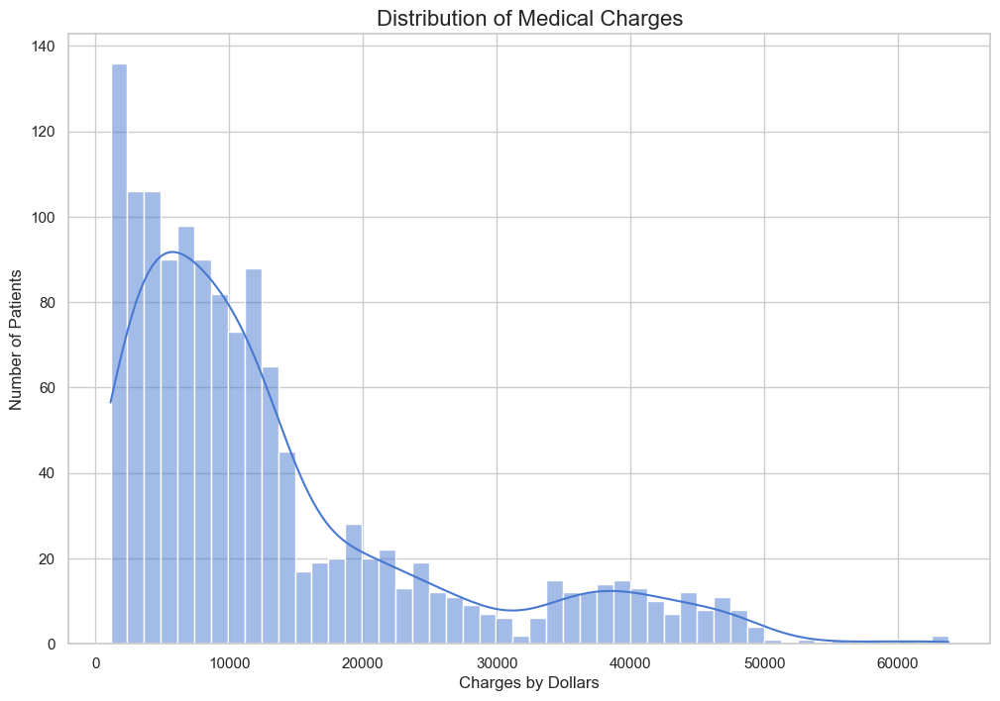
  <figcaption>Figure 1: Distribution of Charges Across Patients</figcaption>
</figure>

In this figure I created a correlation matrix based on all of the features within the dataset including the new features I engineered to further improve my models. This is why some of the features have 95%+ correlation since they are often directly related to each other as insights I took away from the data. The most interesting findings is that smoking has far and away the most correlation to the cost of a patient with the patient's BMI score and age having notable correlation as well. There are many other interesting correlations between features that can be viewed in Figure 2 and it's worth noting that this matrix heavily influenced the features I created at the time of development.

<figure style="text-align: center;">
  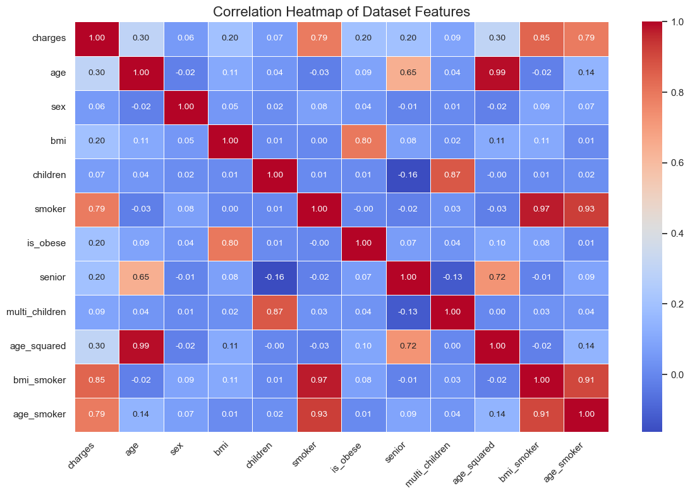
  <figcaption>Figure 2: Correlation Between Features in Dataset</figcaption>
</figure>

I then wanted to plot each patient with the influences of the most correlated features, that being age, BMI score. and whether they smoked to view how that impacted their expected charges. Figure 3 shows that those that do not smoke have the least charges and cost linearly increases with their age. Having a higher BMI does marginally increase cost, but most interestingly is seeing how smoking impacts patients. Those with a low BMI and are smokers are the second highest cost group and the highest are those with a high BMI that are smokers. These are expected trends going into this project as smoking has significant health risks and a higher BMI can be indicative of additional health problems for an individual.

<figure style="text-align: center;">
  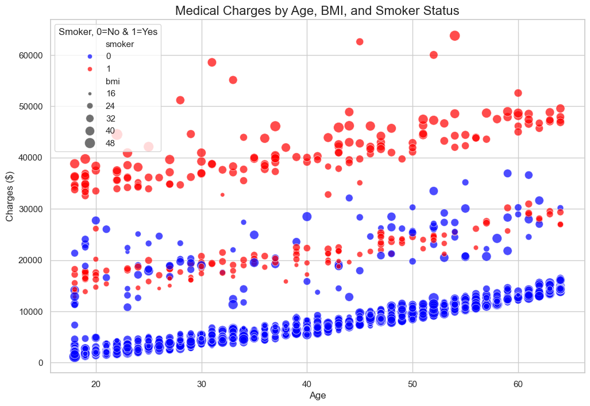
  <figcaption>Figure 3: Individual Charges Based on Key Traits</figcaption>
</figure>

Overall, these figures provided excellent insight into the database and how I can approach the remainder of the model creation.

<ins> Unsupervised Learning </ins>

I wanted to explore the dataset as clusters to gather further insight into how the data was related to each other. I first performed the elbow method to view how how many clusters to create, but it was generally curved. I leaned towards 4 to 5, but once I saw the output produced, I realized 3 clusters visualize the data the best. The figures below give a good bit of insight into how the data can be clustered together and Figure 7 shows what the average member of a cluster looks like.

<figure style="text-align: center;">
  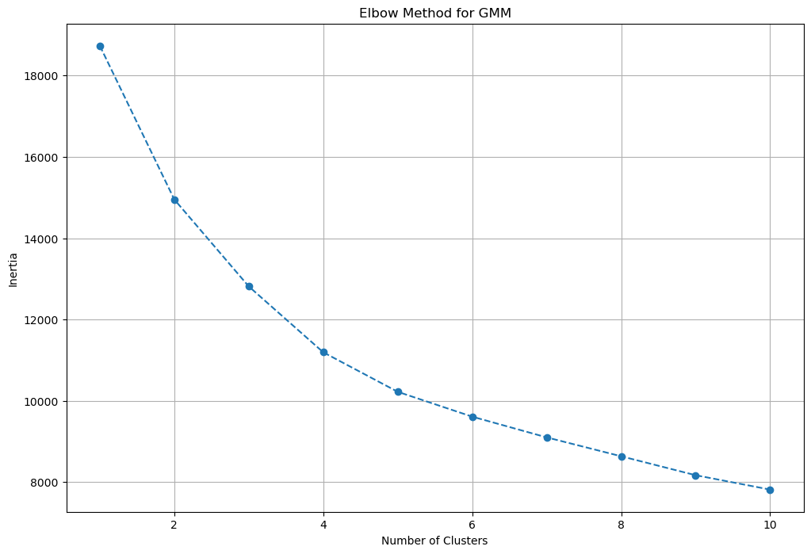
  <figcaption>Figure 4: Elbow Method of Dataset</figcaption>
</figure>

<figure style="text-align: center;">
  
  <figcaption>Figure 5: 3 Clusters Produced by GMM in 2D</figcaption>
</figure>

<figure style="text-align: center;">
  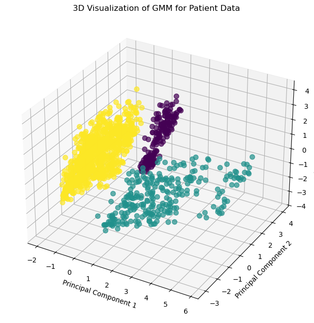
  <figcaption>Figure 6: 3 Clusters Produced by GMM in 3D</figcaption>
</figure>

<figure style="text-align: center;">
  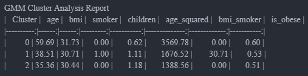
  <figcaption>Figure 7: Average Patient in Each Cluster</figcaption>
</figure>

<ins> Supervised Learning </ins>
I wanted to build 3 classification and 3 regression models to see how each 3 performed for their respective tasks. That way I could view their strengths and weaknesses in depth and infer why they would perform in such a way.

<ins> Regression </ins>
For regression, I built models based on gradient boost regression, linear regression, and random forest regression to see how each model would perform predicting the cost of an patient. I partitioned and cross validated the dataset and saw the following results in the figures below.

<figure style="text-align: center;">
  
  <figcaption>Figure 8: Gradient Boost Regression Results</figcaption>
</figure>

<figure style="text-align: center;">
  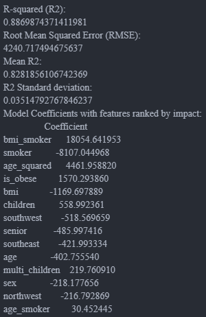
  <figcaption>Figure 9: Linear Regression Results</figcaption>
</figure>

<figure style="text-align: center;">
  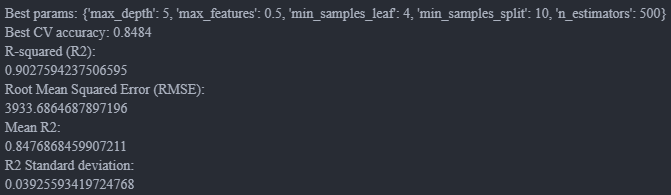
  <figcaption>Figure 10: Random Forest Regression Results</figcaption>
</figure>

<ins> Classification </ins>

For classification, I built models based on gradient boost classification, logistic regression, and random forest classification to see how each model would perform classifying whether a patient can expect a high or low cost. I partitioned and cross validated the dataset and saw the following results in the figures below.

<figure style="text-align: center;">
  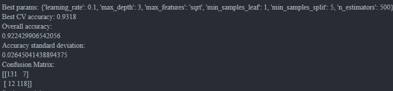
  <figcaption>Figure 11: Gradient Boost Classification Results</figcaption>
</figure>

<figure style="text-align: center;">
  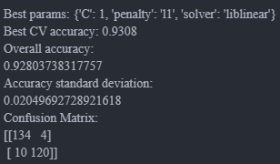
  <figcaption>Figure 12: Logistic Regression Results</figcaption>
</figure>

<figure style="text-align: center;">
  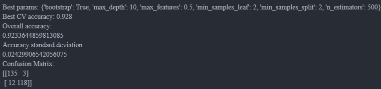
  <figcaption>Figure 13: Random Forest Classification Results</figcaption>
</figure>

Overall I was proud of how the models performed after I tuned them with feature engineering and slight modifications to the models.

The testing of each model was interesting seeing how each model slightly varied based on the input provided.